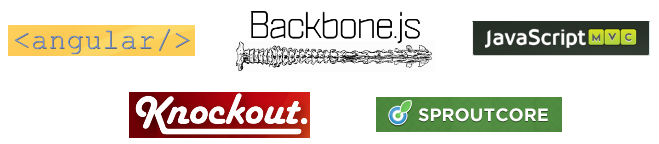
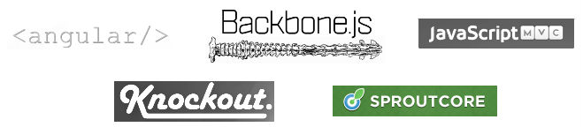
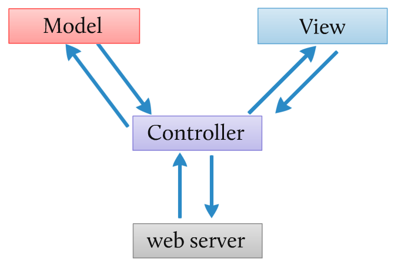
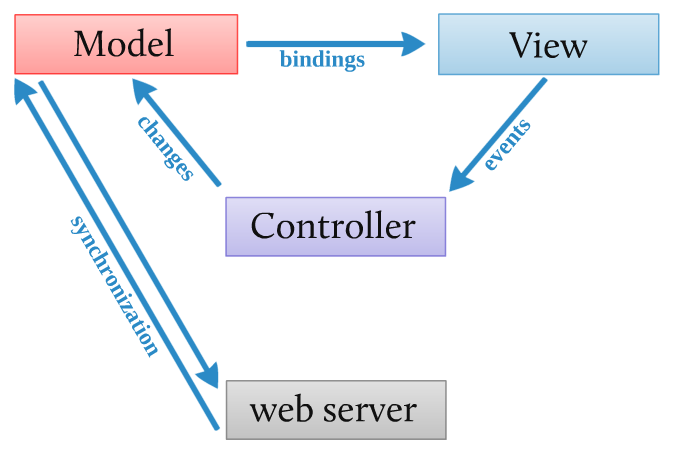

<!SLIDE subsection>

# Building the API #

<!SLIDE>

# Three Phases of API Architecture #

<!SLIDE>

# Small #

	@@@ ruby
	require 'sinatra'

	get '/todos' do
  		Todo.all.to_json
	end

<!SLIDE bullets incremental>

# Small Problems #

* Model growth
* Repetitive Sinatra wiring

<!SLIDE>

# Medium #

	@@@ruby
	resource TimeOff, :base => '/timeoff' do
		default_actions :create, :retrieve, 
			:query, :update, :delete

	end

<!SLIDE bullets incremental>
# Medium Problems #
* Different representations of the same model
* Growing model information that remains server-side
* Performance / scalability concerns

<!SLIDE bullets incremental>
# Large #
* Presenters
* JSON views ([RABL](https://github.com/nesquena/rabl), for instance)

<!SLIDE subsection>
# The Client #

<!SLIDE center>
# Many Ways to do this #

## ...

<!SLIDE center>
# Our Ways to do this #

## ...

<!SLIDE>
# Clientside MVC Is Different! #

<!SLIDE center>

## Server-side MVC

<!SLIDE center>

## Client-side MVC

<!SLIDE center>
# Two Servings of SproutCore #

<!SLIDE small>
# Views #
	@@@ javascript
	// your js
	App.DogView = SC.TemplateView.extend({
	  templateName: 'dogdetail',
 
	  nameBinding: 'App.currentDogController.name',
	  breedBinding: 'App.currentDogController.breed'
	});
	
  

	@@@ html
	<!-- dogdetail.handlebars -->
	<section class="dog">
		{{name}} is a {{breed}}
	</section>

<!SLIDE small>
# Controllers 

	@@@ javascript
	App.dogsController = SC.ArrayProxy.create({
	  addCorgi: function(name) {
	    var corgi = App.Dog.create({ 
				name: name,
				breed: 'Corgi'
			});
		
	    this.pushObject(corgi);
	  },
	
	  corgis: function() {
	    return this.filterProperty('breed', corgi)
			.get('length');

	  }.property('@each.breed'),
	});

<!SLIDE>

# Pros & Cons

<!SLIDE center>

# Two Bits of Backbone #

<!SLIDE small>

# Views

	@@@ javascript
	// your js
	App.DogView = Backbone.View.extend({
	  tagName: "li",
	  template: _.template($('#dogdetail').html()),
	  initialize: function() {
	    this.model.bind('change', this.render);
	  },
	  render: function() {
	    $(this.el).set('html', 
	      this.template(this.model.toJSON()));
	    this.setContent();
	    return this;
	  }
	}

  

	@@@ html
	<!-- in your html -->
	
	
<!SLIDE small>

# Controllers

	@@@ javascript
	App.DogsCollection = Backbone.Collection.extend({
		model: App.Dog,
		
		localStorage: new Store("dog"),
		
		addCorgi: function(name) {
			this.add({breed: 'Corgi', name: name})
			// any view that consumes this collection would
			// need to bind their render() to the "add" event
		},
	
		corgis: function() {
			this.filter(function(dog){
				return todo.get('breed') === 'Corgi'
			}).length;
		}
	});

<!SLIDE>

# Pros & Cons #