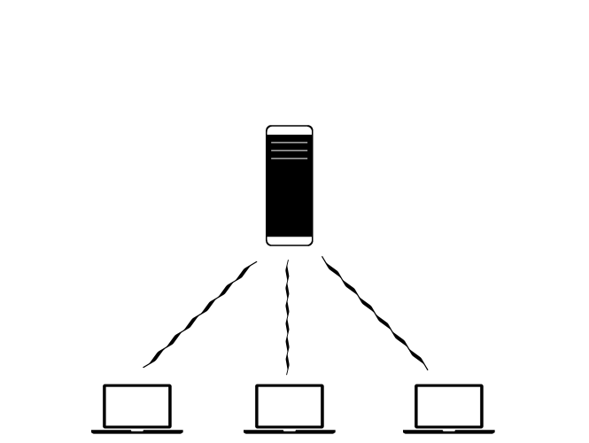
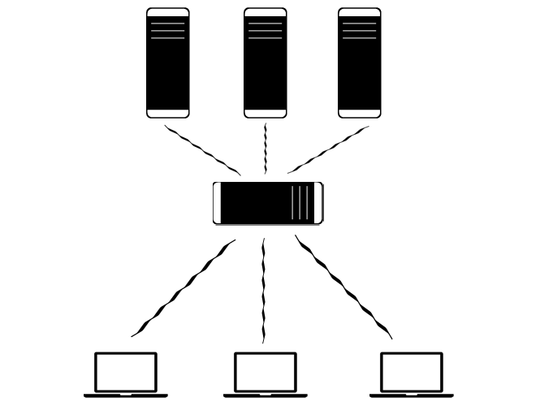

<!SLIDE bullets>

# Problems #
* Different consumers

<!SLIDE center>

<!SLIDE bullets>

# Problems #
* Different consumers
* Richer experiences

<!SLIDE bullets incremental>

# Richer Experiences #

* More desktop like user experience through enhanced client side code
* Entrust JavaScript rather than distrusting it
* What is the sane way to architect a system that accomplishes this?

<!SLIDE bullets>

# Problems #
* Different consumers
* Richer experiences
* Expansive codebases

<!SLIDE subsection>

# Key to "Cheap" Scale #

<!SLIDE bullets>
# Scale of Complexity #

* Structuring complexity more intuitive when everything is already an API or service
* Transitions between architectures are cheaper when you're oriented towards separation of concerns

<!SLIDE bullets>
# Scale of Performance #

* Off-load UI rendering to clients

<!SLIDE center>

<!SLIDE bullets>
# Scale of Performance

* With discipline to keep your API silos isolated, you can scale horizontally with ease

<!SLIDE center>

<!SLIDE bullets center>
# Scale of Organization #

* Leaner slices and mental models = faster ramp-up time
* Separation of organizational concerns = easier team splits

<!SLIDE>

# Additional Considerations #

Think about how not only client consumes API, but how API endpoints interact w/ one another

<!SLIDE>
# Additional Considerations #
// Remaining decoupled while still useful

<!SLIDE>
# Additional Considerations #
// Do we need MVC on "both sides" of the wall?

<!SLIDE>
# Additional Considerations #
// stateless-ness of this model. State of the client-interactions are managed on the client, and the server manages the persistence/state of the business domain
