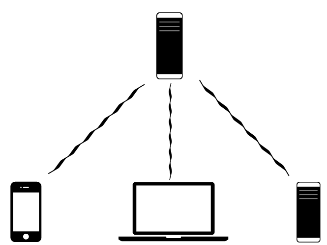

<!SLIDE center>
# Tangled Problems #

<!SLIDE bullets incremental>
# What we want: #
* A system adaptable to change
* Clearer responsibility of components
* Rich client experience and clean server side code

<!SLIDE center>

<!SLIDE bullets>
# Multiple Clients #
* How do we deliver content to diverse clients?

<!SLIDE center>

<!SLIDE bullets incremental>
# Richer Experiences #
* More desktop like user experience through enhanced client side code
* Entrust JavaScript rather than distrusting it

<!SLIDE bullets>
# People #
* Ability to hone in on area of the system
* Clear ownerships of components 

<!SLIDE bullets>
* What is the sane way to architect a system that accomplishes this?

<!SLIDE center>
# Decoupling #

<!SLIDE bullets>
# Decouple Complexity #

* Isolate parts of your app that are likely to change
* UI and user facing components are more volatile
* Focus on interfaces

<!SLIDE bullets center>
# Decouple Teams #

* Leaner slices = faster ramp-up time
* Separation of organizational concerns = easier team splits

<!SLIDE bullets>
# Decouple Performance #

<!SLIDE center>

<!SLIDE center>

<!SLIDE bullets>
# Caveat Buildor #
* Do you have these problems?
